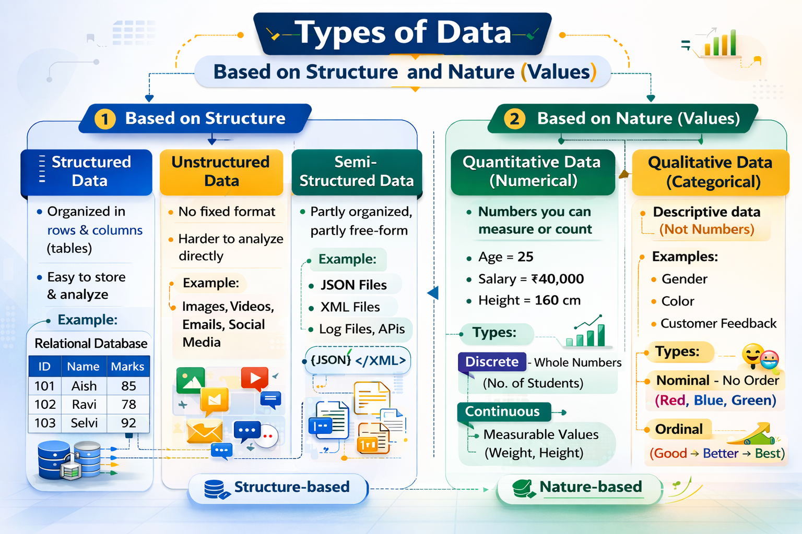

# 1. What is data? 
Data is a collection of information. 
# 2. Types of data 

# 3. What is data cleaning? 
Data cleaning is the process of fixing or removing incorrect, missing, duplicate, or invalid data.
### Examples:
    - Removing None
    - Removing duplicate records
# 4. What is data filtering? 
Selecting a subset of data based on specific conditions (e.g., marks > 75, only passed students).
# 5. Why NumPy is needed? 
NumPy is a Python library for numerical computing. It provides fast operations on arrays, mathematical functions, and tools for data manipulation.
### Benefits:
    - Faster than normal loops and lists
    - Supports arrays and matrices 
    - built in mathematical functions
    - Speed up data processing 
    - Handle large datasets
    - Useful for data analysis and machine learning
    
